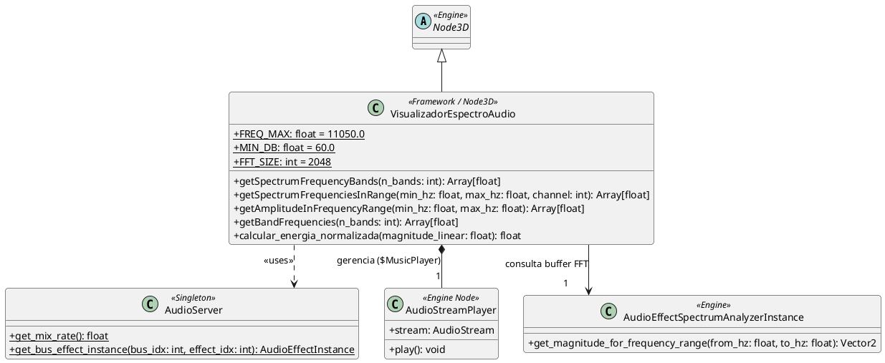

# Framework Base: Animação Orientada a Espectro Sonoro

---

## Objetivo deste Framework

Olá, turma! 

O objetivo deste projeto base é fornecer a vocês uma infraestrutura pronta e matematicamente calibrada para extração e processamento de dados do espectro de áudio em tempo real. 

Com este framework, vocês **não precisam reinventar a roda** na leitura da FFT (Fast Fourier Transform), na conversão logarítmica de decibéis ou no cálculo de frequências de Nyquist. O script já entrega os valores de energia do som normalizados entre $0.0$ e $1.0$, permitindo que vocês foquem no cerne do trabalho: **o mapeamento criativo desses dados para alimentar animações procedurais** (seja pela Opção A, B ou C).

---

## Estrutura da Arquitetura

O diagrama abaixo ilustra como o script fornecido se conecta ao servidor interno de áudio da Godot (`AudioServer`), ao nó de reprodução (`AudioStreamPlayer`) e quais métodos estão disponíveis para vocês:



---

## ⚙️ Configuração Obrigatória no Editor (Godot 4)

Para que a captura do espectro funcione, o pipeline de áudio da Godot precisa ser configurado com o analisador de efeito:

1. **Ativar o Efeito no Audio Bus:**
   * Na barra inferior do editor, clique na aba **Audio**.
   * No barramento **Master** (índice 0), clique em **Add Effect** no primeiro slot (índice 0).
   * Escolha **SpectrumAnalyzer**.
   * *(Opcional)* No painel Inspector do efeito, você pode conferir o `Fft Size`, que por padrão deve estar alinhado com a constante do script (`2048`).

2. **Árvore de Nós (Scene Tree):**
   * O nó raiz deve possuir o script anexado.
   * Crie um nó filho do tipo **`AudioStreamPlayer`** (não utilize nós 2D ou 3D para música de fundo) e garanta que seu nome seja exatamente **`MusicPlayer`**.
   * Arraste a música escolhida (`.ogg`, `.mp3` ou `.wav`) para o campo **Stream** no Inspector do nó.

---

## Fundamentação Teórica (O que o script faz por vocês)

### 1. Teorema de Nyquist e Resolução por Frequência
A maior frequência analisável em áudio digital sem distorção é a metade da frequência de amostragem ($f_{\text{mix}}$):

$$
f_{\text{Nyquist}} = \frac{f_{\text{mix}}}{2}
$$

Para a taxa padrão da Godot ($44.100\text{ Hz}$), $f_{\text{Nyquist}} = 22.050\text{ Hz}$. A FFT com tamanho de janela $N = 2048$ divide o espectro em subdivisões (*bins*) com resolução constante:

$$
\Delta f = \frac{f_{\text{Nyquist}}}{N / 2} = \frac{22050}{1024} \approx 21{,}53\text{ Hz por bin}
$$

### 2. Normalização em Decibéis (Percepção Humana)
A audição humana responde ao volume de forma logarítmica. Uma leitura puramente linear faz com que nuances musicais passem despercebidas. O script faz a conversão direta:

$$
\text{dB} = 20 \cdot \log_{10}(\text{magnitude})
$$

Em seguida, o valor é remapeado sobre a constante $MIN\_DB = 60\text{ dB}$, entregando saídas limpas no intervalo $[0.0, 1.0]$.

---

## API do Framework: Como consumir os dados

Vocês têm à disposição os seguintes métodos para chamar a cada frame (dentro do `_process`):

### 1. `getSpectrumFrequencyBands(n_bands: int) -> Array[float]` ⭐ *(Mais recomendado)*
Divide o espectro audível ($0\text{ Hz}$ até $11.050\text{ Hz}$) em $N$ fatias iguais. É a função ideal para criar barras de equalizador ou distribuir dados para múltiplos objetos.
* **Exemplo:** `getSpectrumFrequencyBands(8)` retorna um array de 8 floats, onde o índice 0 são os subgraves e o índice 7 são os agudos extremos.

### 2. `getSpectrumFrequenciesInRange(min_hz: float, max_hz: float, channel: int) -> Array[float]`
Lê uma faixa específica em Hertz permitindo filtrar pelo canal de áudio:
* `channel = 0`: Canal Esquerdo (Left)
* `channel = 1`: Canal Direito (Right)
* `channel = -1`: Mix estéreo combinado

### 3. `getBandFrequencies(n_bands: int) -> Array[float]`
Método utilitário que retorna a lista dos limites superiores em Hertz de cada banda calculada (útil para debug e rotulagem).

---

## Exemplo Prático de Uso (Para colocar no `_process`)

Abaixo está um exemplo de como vocês podem estender ou preencher o `_process` do script para manipular objetos 3D com interpolação suave (`lerp`):

```gdscript
@onready var cubo_grave: MeshInstance3D = $CuboGrave
@onready var cubo_medio: MeshInstance3D = $CuboMedio

var energia_grave_suavizada: float = 0.0

func _process(delta: float) -> void:
    if not spectrum_analyzer:
        return
        
    # 1. Captura 8 bandas de frequência
    var bandas = getSpectrumFrequencyBands(8)
    
    # Banda 0 = Graves/Bumbo (~0 Hz a 1380 Hz)
    var energia_grave_instantanea = bandas[0]
    
    # 2. Suavização (lerp) para evitar jitter e solavancos bruscos na animação
    energia_grave_suavizada = lerpf(energia_grave_suavizada, energia_grave_instantanea, 15.0 * delta)
    
    # 3. Mapeamento para a propriedade visual (ex: escala vertical)
    cubo_grave.scale.y = 1.0 + (energia_grave_suavizada * 4.0)
```

---

## 📋 Opções de Trabalho (Lembrete do Enunciado)

Utilizem os dados fornecidos por este framework para desenvolver a sua solução em uma das três frentes:

* **Opção A — Movimentação / Transformação de Objetos:** Comportamento de agentes, trajetórias com easing, velocidades, disparos, escalas ou partículas sincronizadas com a batida.
* **Opção B — Deformação de Malhas Poligonais:** Variação de malha através de Blendshapes, deformação procedural de vértices via código ou shaders acionados por frequências específicas.
* **Opção C — Expressões Faciais ou Corporais:** Personagens ou rigs que transitam entre poses emocionais/coreografias através de animações conduzidas pelas faixas espectrais.

---

## Dicas da Professora

1. **Não acumule leituras pesadas:** O método `getSpectrumFrequencyBands` já é otimizado com pré-alocação de memória (`resize`), sendo seguro chamá-lo todo frame.
2. **Use suavização (`lerpf`):** Dados de áudio oscilam com extrema rapidez. Aplicar um filtro de suavização entre o frame anterior e o atual costuma deixar o resultado estético muito mais agradável.
3. **Explique seu mapeamento:** Na entrega do trabalho, a justificativa teórica de *por que* certa faixa de Hertz controla determinado elemento visual é um critério central de avaliação!
